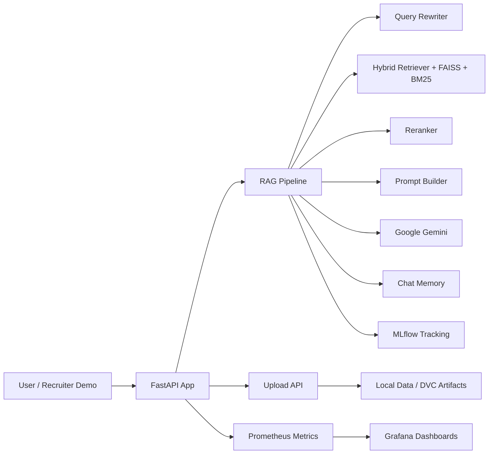

# Production RAG System

[](https://github.com/AK-Jeevan/production-rag-system/actions/workflows/ci.yml)

Production RAG System is a production-oriented Retrieval-Augmented Generation application built with FastAPI, LangChain, FAISS, MLflow, DVC, Prometheus, and Grafana. It is designed to ingest documents, index them, retrieve relevant context, rerank results, and generate grounded answers with Google Gemini. The project is containerized, test-covered, and structured to look like a real-world MLOps system that can be demonstrated in interviews or adapted for deployment.

## Why This Project Stands Out

- End-to-end RAG pipeline with ingestion, retrieval, reranking, prompt building, generation, and conversational memory.
- FastAPI backend with REST endpoints for query, streaming query, uploads, feedback, health, and metrics.
- MLflow tracking for model and pipeline observability.
- DVC-based data workflow for large document assets and reproducible pipelines.
- Monitoring stack with Prometheus and Grafana.
- Docker-first setup for consistent local development and cloud deployment.
- Recruiter-friendly implementation that demonstrates MLOps, API design, observability, and cloud readiness.

## High-Level Architecture



## Core Capabilities

### RAG Pipeline

The pipeline rewrites user questions, retrieves relevant chunks, reranks the results, builds a prompt, and generates a final answer. It also captures latency, token usage, and estimated cost so the system can be evaluated like a real production service.

### Document Ingestion

Documents can be uploaded through the API and stored under `data/raw/uploads`. The ingestion layer supports PDF, TXT, DOCX, and MD files and is built to work with a DVC-managed document corpus.

### Observability

The app exposes Prometheus metrics and logs to support operational visibility. MLflow is used to record pipeline parameters and execution metrics.

### Conversational Memory

A lightweight chat memory layer keeps short-lived conversational context so follow-up questions can be rewritten more effectively.

### Developer Experience

The repository includes a CLI entrypoint, automated tests, containerization, and CI coverage enforcement. It is intentionally shaped to show engineering depth rather than just a proof-of-concept demo.

## Tech Stack

- Backend: FastAPI, Uvicorn, Pydantic
- RAG Orchestration: LangChain
- Retrieval: FAISS, BM25, hybrid retrieval, reranking
- LLM Provider: Google Gemini
- Tracking: MLflow
- Data Versioning: DVC
- Monitoring: Prometheus, Grafana
- Packaging and Deployment: Docker, GitHub Actions
- Testing: Pytest, pytest-cov, pytest-httpx, pytest-asyncio

## Repository Layout

- `app/` - FastAPI application, API routers, schemas, and service layer
- `src/` - Core RAG pipeline, retrieval, generation, embeddings, ingestion, memory, monitoring, and utilities
- `config/` - Prompt registry and other configuration assets
- `data/` - Raw, processed, and feedback datasets managed for local development and DVC workflows
- `models/` - Persisted vector store and related model artifacts
- `prometheus/` - Prometheus configuration
- `tests/` - Automated test suite
- `run_cli.py` - Interactive CLI for local RAG queries
- `Dockerfile` - Container image definition
- `docker-compose.yml` - Local multi-service stack with FastAPI, MLflow, Prometheus, and Grafana

## Local Setup

### Prerequisites

- Python 3.11
- Git
- Docker and Docker Compose
- A valid `GOOGLE_API_KEY`

### Install Dependencies

```bash
python -m pip install --upgrade pip
pip install -r requirements.txt -r requirements-dev.txt
```

### Environment Variables

Create a `.env` file in the project root with at least:

```env
GOOGLE_API_KEY=your_google_gemini_api_key
```

If you run MLflow externally, set its tracking URI in the application environment or update the tracker configuration to point to your hosted server.

### Run the API Locally

```bash
uvicorn app.main:app --reload --host 0.0.0.0 --port 8000
```

Open:

- API docs: `http://localhost:8000/docs`
- ReDoc: `http://localhost:8000/redoc`
- Health check: `http://localhost:8000/api/v1/health`

### Run the Interactive CLI

```bash
python run_cli.py
```

### Run Tests

```bash
pytest
```

## Docker

Build and run the app container:

```bash
docker build -t production-rag-system .
docker run -p 8000:8000 --env-file .env production-rag-system
```

## Docker Compose Stack

The included `docker-compose.yml` starts the API plus supporting services:

- FastAPI app on port `8000`
- MLflow on port `5000`
- Prometheus on port `9090`
- Grafana on port `3000`

Start the full stack with:

```bash
docker compose up --build
```

## API Endpoints

- `GET /` - Landing page with documentation links
- `GET /api/v1/health` - Health check
- `POST /api/v1/query` - Ask a question and receive a grounded response
- `POST /api/v1/query-stream` - Stream the response token by token
- `POST /api/v1/upload` - Upload a document for ingestion
- `POST /api/v1/feedback` - Submit answer feedback
- `GET /api/v1/metrics` - Prometheus metrics

## Data and MLflow

This project is built around reproducibility.

- Document assets can be managed with DVC.
- MLflow records pipeline parameters, latency, token counts, and estimated cost.
- `models/` contains local vector-store artifacts for FAISS.

## AWS Deployment

This repository is container-ready, so the cleanest AWS path is a Docker-based deployment. The project does not currently include Terraform, CloudFormation, or CDK, so the following is a practical deployment architecture you can describe in an interview or implement next.

### Recommended AWS Architecture

- Amazon ECR for storing the Docker image.
- Amazon ECS Fargate or EC2 for running the FastAPI container.
- Application Load Balancer in front of the service.
- Amazon S3 for uploaded documents, processed artifacts, and DVC remote storage.
- Amazon CloudWatch for container logs and infrastructure monitoring.
- AWS Secrets Manager or SSM Parameter Store for `GOOGLE_API_KEY` and other secrets.
- Separate ECS service or EC2 instance for MLflow tracking if you want persistent experiment tracking in AWS.
- Amazon EFS or S3-backed volumes if you need persistent shared storage for artifacts.

### Deployment Flow

1. Build the Docker image locally or in CI.
2. Push the image to Amazon ECR.
3. Deploy the image to ECS Fargate behind an Application Load Balancer.
4. Inject secrets and environment variables through AWS Secrets Manager or Parameter Store.
5. Store durable data in S3 and point DVC remote storage there.
6. Route logs and metrics to CloudWatch; keep Prometheus and Grafana if you want a richer self-hosted observability stack.

### Interview Notes for AWS

- The app is already containerized, which makes ECS deployment straightforward.
- The LLM is external to AWS: the service calls Google Gemini through API credentials.
- AWS is used for hosting, storage, secrets, logging, and service orchestration, not for hosting the model itself.
- If you want a more enterprise-style story, mention blue/green ECS deployments, autoscaling, and centralized logging.

## Testing and Quality

The repository is configured with pytest, coverage reporting, and CI enforcement. The current pipeline validates the API, ingestion, retrieval, generation, and monitoring layers.

```bash
pytest --tb=short --verbose
```

## CI/CD

GitHub Actions runs tests, coverage, linting, and Docker image builds. The CI badge at the top of this README should reflect the current main branch status.

## Recruiter Summary

If you are showing this project in an interview, the strongest talking points are:

- You built a real RAG pipeline rather than a toy chatbot.
- You separated API, pipeline, retrieval, generation, monitoring, and data concerns cleanly.
- You added observability with Prometheus and MLflow.
- You used DVC to emphasize reproducibility and data governance.
- You containerized the app and mapped it to a realistic AWS deployment path.

## Future Improvements

- Add Terraform or AWS CDK for one-click infrastructure provisioning.
- Move MLflow to a managed or persistent AWS-hosted deployment.
- Add S3-backed document ingestion and remote DVC storage configuration.
- Add request authentication and rate limiting for production hardening.
- Add system diagrams and screenshots for the README.

## License

This project is released under the terms of the [LICENSE](LICENSE) file.
