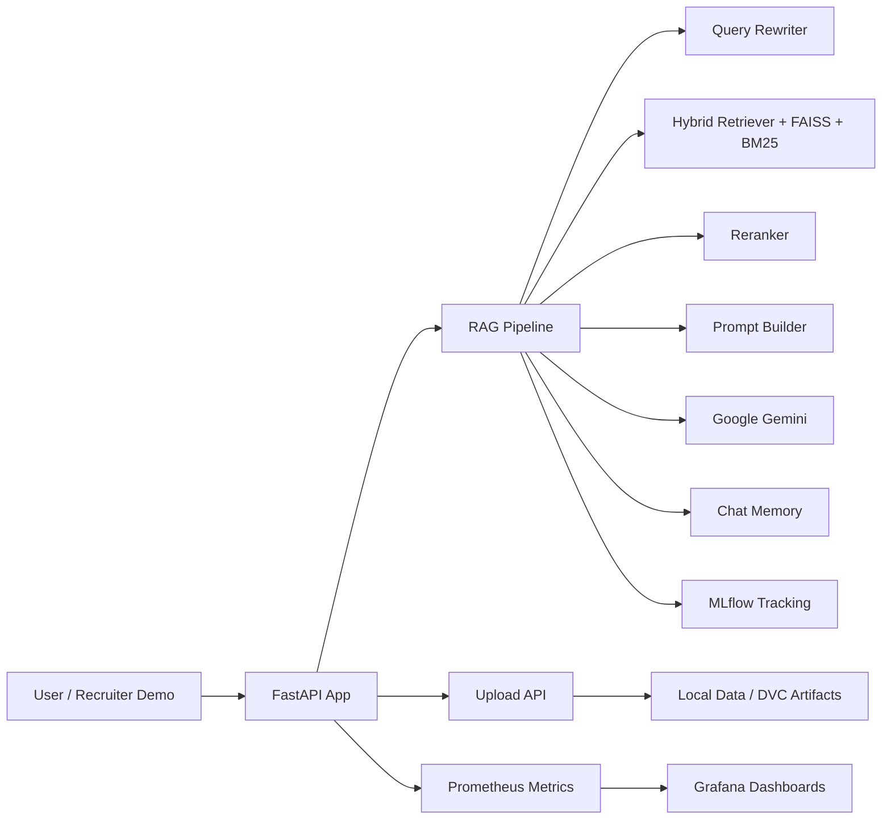

# Production RAG System

[](https://github.com/AK-Jeevan/production-rag-system/actions/workflows/ci.yml)
[](https://github.com/AK-Jeevan/production-rag-system/actions/workflows/deploy.yml)

Production RAG System is a production-oriented Retrieval-Augmented Generation platform built with FastAPI, LangChain, FAISS, MLflow, DVC, Prometheus, and Grafana. It is designed to ingest documents, index them, retrieve relevant context, rerank results, and generate grounded answers with Google Gemini. The project is containerized, test-covered, and organized to reflect a real-world MLOps service suitable for interviews, demos, and deployment.

## Key Highlights

- End-to-end RAG pipeline with ingestion, retrieval, reranking, prompt building, generation, and conversational memory.
- FastAPI backend with REST endpoints for query, streaming query, uploads, feedback, health, and metrics.
- MLflow tracking for model and pipeline observability.
- DVC-based data workflow for large document assets and reproducible pipelines.
- Monitoring stack with Prometheus and Grafana.
- Docker-first setup for consistent local development and cloud deployment.
- Recruiter-friendly implementation that demonstrates MLOps, API design, observability, and cloud readiness.

## High-Level Architecture


```mermaid
flowchart LR
	U[User / Recruiter Demo] --> API[FastAPI App]
	API --> RAG[RAG Pipeline]
	RAG --> RE[Query Rewriter]
	RAG --> RT[Hybrid Retriever + FAISS + BM25]
	RAG --> RR[Reranker]
	RAG --> PB[Prompt Builder]
	RAG --> GM[Google Gemini]
	RAG --> MM[Chat Memory]
	RAG --> MF[MLflow Tracking]
	API --> UP[Upload API]
	UP --> DATA[Local Data / DVC Artifacts]
	API --> MON[Prometheus Metrics]
	MON --> GRAF[Grafana Dashboards]
```

## Core Capabilities

### RAG Pipeline

The pipeline rewrites user questions, retrieves relevant chunks, reranks the results, builds a prompt, and generates a final answer. It also captures latency, token usage, and estimated cost so the system can be evaluated like a real production service.

### Document Ingestion

Documents can be uploaded through the API and stored under `data/raw/uploads`. The ingestion layer supports PDF, TXT, DOCX, and MD files and is built to work with a DVC-managed document corpus.

### Observability

The app exposes Prometheus metrics and logs to support operational visibility. MLflow is used to record pipeline parameters and execution metrics.

### Conversational Memory

A lightweight chat memory layer keeps short-lived conversational context so follow-up questions can be rewritten more effectively.

### Developer Experience

The repository includes a CLI entrypoint, automated tests, containerization, and CI coverage enforcement. It is intentionally shaped to show engineering depth rather than just a proof-of-concept demo.

## Tech Stack

- Backend: FastAPI, Uvicorn, Pydantic
- RAG Orchestration: LangChain
- Retrieval: FAISS, BM25, hybrid retrieval, reranking
- LLM Provider: Google Gemini
- Tracking: MLflow
- Data Versioning: DVC
- Monitoring: Prometheus, Grafana
- Container Orchestration: Kubernetes (minikube, kind, or cloud K8s)
- Packaging and Deployment: Docker, GitHub Actions
- Testing: Pytest, pytest-cov, pytest-httpx, pytest-asyncio

## Repository Layout

- `app/` - FastAPI application, API routers, schemas, and service layer
- `src/` - Core RAG pipeline, retrieval, generation, embeddings, ingestion, memory, monitoring, and utilities
- `config/` - Prompt registry and other configuration assets
- `data/` - Raw, processed, and feedback datasets managed for local development and DVC workflows
- `k8s/` - Kubernetes manifests for the full multi-service stack (FastAPI, MLflow, Prometheus, Grafana)
- `models/` - Persisted vector store and related model artifacts
- `prometheus/` - Prometheus configuration
- `tests/` - Automated test suite
- `run_cli.py` - Interactive CLI for local RAG queries
- `Dockerfile` - Container image definition
- `docker-compose.yml` - Local multi-service stack with FastAPI, MLflow, Prometheus, and Grafana

## Local Setup

### Prerequisites

- Python 3.11
- Git
- Docker and Docker Compose
- A valid `GOOGLE_API_KEY`

### Install Dependencies

```bash
python -m pip install --upgrade pip
pip install -r requirements.txt -r requirements-dev.txt
```

### Environment Variables

Create a `.env` file in the project root with at least:

```env
GOOGLE_API_KEY=your_google_gemini_api_key
```

If you run MLflow externally, set its tracking URI in the application environment or update the tracker configuration to point to your hosted server.

### Run the API Locally

```bash
uvicorn app.main:app --reload --host 0.0.0.0 --port 8000
```

Open:

- API docs: `http://localhost:8000/docs`
- ReDoc: `http://localhost:8000/redoc`
- Health check: `http://localhost:8000/api/v1/health`

### Run the Interactive CLI

```bash
python run_cli.py
```

### Run Tests

```bash
pytest
```

### Run RAGAS Evaluation

The evaluation pipeline queries the real RAG service, scores each answer with
faithfulness, answer relevancy, context precision, and context recall, then
writes timestamped JSON and CSV reports under `evaluation/results/`.

Edit `evaluation/datasets/rag_eval.json` to add domain-specific questions and
reference answers, then run:

```bash
python run_evaluation.py
```

Useful overrides:

```bash
python run_evaluation.py --dataset evaluation/datasets/rag_eval.json --retrieval-top-k 20 --rerank-top-k 5
```

RAGAS uses Gemini as the evaluator LLM and the local MiniLM model for answer
relevancy embeddings, so `GOOGLE_API_KEY` must be configured.

## Deployment

This project is designed to run locally with Docker and to scale into a cloud-hosted deployment without changing the application architecture.

### Container Image

Build and run the application container directly when you want a minimal runtime footprint:

```bash
docker build -t production-rag-system .
docker run -p 8000:8000 --env-file .env production-rag-system
```

### Docker Compose Stack

Use the included `docker-compose.yml` to start the API alongside the supporting services used in the project:

- FastAPI application on port `8000`
- MLflow on port `5000`
- Prometheus on port `9090`
- Grafana on port `3000`

Start the full stack with:

```bash
docker compose up --build
```

### Kubernetes Deployment

This project ships with production-grade Kubernetes manifests under `k8s/`, enabling you to deploy the entire RAG stack onto any Kubernetes cluster (minikube, kind, EKS, AKS, GKE) with a single command.

#### Stack Components

| Component  | Manifests                     | Replicas | Persistence     | Notes                                            |
|------------|-------------------------------|----------|-----------------|--------------------------------------------------|
| FastAPI    | `k8s/fastapi/`                | 2        | —               | Stateless RAG API with rolling updates            |
| MLflow     | `k8s/mlflow/`                 | 1        | 5 GiB PVC       | SQLite-backed tracking server                    |
| Prometheus | `k8s/prometheus/`             | 1        | EmptyDir        | 15-day retention, hot-reload enabled             |
| Grafana    | `k8s/grafana/`                | 1        | PVC             | Pre-configured dashboards, admin creds via Secret |
| Ingress    | `k8s/ingress.yaml`            | —        | —               | NGINX Ingress with SSE streaming support         |
| Namespace  | `k8s/namespace.yaml`          | —        | —               | `production-rag-system` logical isolation        |

#### Key Kubernetes Features

- **Namespace Isolation** — All resources reside in the `production-rag-system` namespace, cleanly separating the RAG stack from other workloads.
- **Zero-Downtime Deployments** — FastAPI uses a rolling update strategy (`maxSurge: 1`, `maxUnavailable: 0`) so incoming requests are never dropped during updates.
- **Health Probes** — Every service includes both readiness and liveness probes, ensuring the load balancer routes traffic only to healthy pods and Kubernetes auto-restarts unhealthy ones.
- **Resource Governance** — CPU and memory requests/limits are set for every container, preventing resource starvation and noisy-neighbour issues on shared clusters.
- **Secret Injection** — Sensitive values (`GOOGLE_API_KEY`, Grafana admin credentials) are injected via `Secret` resources rather than hard-coded environment variables or plain-text config.
- **Persistent Storage** — MLflow and Grafana mount PersistentVolumeClaims so experiment data and dashboard configurations survive pod restarts.
- **Optimised Ingress** — The NGINX Ingress controller is configured with streaming-friendly settings (buffering off, HTTP/1.1, long timeouts, 20 MB upload limit) to support SSE-based `/query-stream` and large document uploads.

#### Deploy the Full Stack

```bash
# 1. Create the namespace and all resources
kubectl apply -f k8s/namespace.yaml
kubectl apply -f k8s/

# 2. Verify everything is running
kubectl get all -n production-rag-system

# 3. Access the API via the Ingress (or port-forward)
kubectl port-forward -n production-rag-system svc/fastapi-service 8000:80
```

> **Note**: Before deploying, create the required Secrets (`rag-secrets` and `grafana-secret`) with your `GOOGLE_API_KEY` and desired Grafana credentials. For a full production cluster, replace Prometheus's `emptyDir` with a PersistentVolumeClaim and configure an external database backend for MLflow.

### AWS Reference Deployment

The repository is container-ready, so the most practical AWS deployment path is to run the service as a Docker image behind managed infrastructure.

- Amazon ECR for container image storage
- Amazon ECS Fargate or EC2 for application hosting
- Application Load Balancer for traffic distribution
- Amazon S3 for uploaded documents, processed artifacts, and DVC remote storage
- AWS Secrets Manager or SSM Parameter Store for `GOOGLE_API_KEY` and other secrets
- Amazon CloudWatch for logs and infrastructure monitoring
- A separate MLflow deployment if persistent experiment tracking is required

Recommended deployment flow:

1. Build the Docker image in CI or locally.
2. Push the image to Amazon ECR.
3. Deploy the image to ECS behind an Application Load Balancer.
4. Inject secrets and runtime configuration through AWS Secrets Manager or Parameter Store.
5. Store durable document and artifact data in S3.
6. Route logs and metrics to CloudWatch while keeping Prometheus and Grafana if you want richer self-hosted observability.

For interview or production planning, the strongest message is that the application remains container-native, while AWS provides the hosting, storage, secrets, and orchestration layers.

## API Endpoints

- `GET /` - Landing page with documentation links
- `GET /api/v1/health` - Health check
- `POST /api/v1/query` - Ask a question and receive a grounded response
- `POST /api/v1/query-stream` - Stream the response token by token
- `POST /api/v1/upload` - Upload a document for ingestion
- `POST /api/v1/feedback` - Submit answer feedback
- `GET /api/v1/metrics` - Prometheus metrics

## Data and MLflow

This project is built around reproducibility.

- Document assets can be managed with DVC.
- MLflow records pipeline parameters, latency, token counts, and estimated cost.
- RAGAS reports retrieval quality, answer relevance, and grounding metrics.
- `models/` contains local vector-store artifacts for FAISS.

## Testing and Quality

The repository is configured with pytest, coverage reporting, and CI enforcement. The current pipeline validates the API, ingestion, retrieval, generation, and monitoring layers.

```bash
pytest --tb=short --verbose
```

## CI/CD

GitHub Actions runs tests, coverage, linting, and Docker image builds. The CI badge at the top of this README should reflect the current main branch status.

## Recruiter Summary

If you are showing this project in an interview, the strongest talking points are:

- You built a real RAG pipeline rather than a toy chatbot.
- You separated API, pipeline, retrieval, generation, monitoring, and data concerns cleanly.
- You added observability with Prometheus and MLflow.
- You used DVC to emphasize reproducibility and data governance.
- You containerized the app and mapped it to a realistic AWS deployment path.
- You provided a fully container-orchestrated Kubernetes deployment with rolling updates, health probes, resource governance, persistence, and ingress routing — demonstrating production readiness at scale.

## Future Improvements

- Add Terraform or AWS CDK for one-click infrastructure provisioning.
- Move MLflow to a managed or persistent AWS-hosted deployment.
- Add S3-backed document ingestion and remote DVC storage configuration.
- Add request authentication and rate limiting for production hardening.
- Add system diagrams and screenshots for the README.
- Replace Prometheus `emptyDir` storage with a PersistentVolumeClaim for metrics durability.
- Migrate MLflow from SQLite to a managed PostgreSQL instance for reliability at scale.
- Add HorizontalPodAutoscaler for the FastAPI service based on CPU/memory utilisation.
- Implement a Helm chart for parameterised, environment-aware deployments.

## License

This project is released under the terms of the [LICENSE](LICENSE) file.
