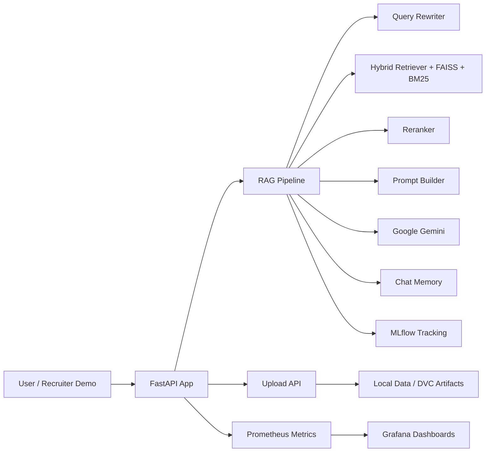

# Production RAG System

[](https://github.com/AK-Jeevan/production-rag-system/actions/workflows/ci.yml)

Production RAG System is a production-oriented Retrieval-Augmented Generation platform built with FastAPI, LangChain, FAISS, MLflow, DVC, Prometheus, and Grafana. It is designed to ingest documents, index them, retrieve relevant context, rerank results, and generate grounded answers with Google Gemini. The project is containerized, test-covered, and organized to reflect a real-world MLOps service suitable for interviews, demos, and deployment.

## Key Highlights

- End-to-end RAG pipeline with ingestion, retrieval, reranking, prompt building, generation, and conversational memory.
- FastAPI backend with REST endpoints for query, streaming query, uploads, feedback, health, and metrics.
- Gradio-based web UI for interactive chat and document upload.
- MLflow tracking for model and pipeline observability.
- DVC-based data workflow for large document assets and reproducible pipelines.
- Monitoring stack with Prometheus and Grafana.
- Docker-first setup for consistent local development and cloud deployment.
- Recruiter-friendly implementation that demonstrates MLOps, API design, observability, and cloud readiness.

## High-Level Architecture


```mermaid
flowchart LR
	U[User / Recruiter Demo] --> API[FastAPI App]
	API --> RAG[RAG Pipeline]
	RAG --> RE[Query Rewriter]
	RAG --> RT[Hybrid Retriever + FAISS + BM25]
	RAG --> RR[Reranker]
	RAG --> PB[Prompt Builder]
	RAG --> GM[Google Gemini]
	RAG --> MM[Chat Memory]
	RAG --> MF[MLflow Tracking]
	API --> UP[Upload API]
	UP --> DATA[Local Data / DVC Artifacts]
	API --> MON[Prometheus Metrics]
	MON --> GRAF[Grafana Dashboards]
```

## Core Capabilities

### RAG Pipeline

The pipeline rewrites user questions, retrieves relevant chunks, reranks the results, builds a prompt, and generates a final answer. It also captures latency, token usage, and estimated cost so the system can be evaluated like a real production service.

### Document Ingestion

Documents can be uploaded through the API and stored under `data/raw/uploads`. The ingestion layer supports PDF, TXT, DOCX, and MD files and is built to work with a DVC-managed document corpus.

### Observability

The app exposes Prometheus metrics and logs to support operational visibility. MLflow is used to record pipeline parameters and execution metrics.

### Conversational Memory

A lightweight chat memory layer keeps short-lived conversational context so follow-up questions can be rewritten more effectively.

### Developer Experience

The repository includes a CLI entrypoint, automated tests, containerization, and CI coverage enforcement. It is intentionally shaped to show engineering depth rather than just a proof-of-concept demo.

## Tech Stack

- Backend: FastAPI, Uvicorn, Pydantic
- RAG Orchestration: LangChain
- Retrieval: FAISS, BM25, hybrid retrieval, reranking
- LLM Provider: Google Gemini
- Tracking: MLflow
- Data Versioning: DVC
- Monitoring: Prometheus, Grafana
- Container Orchestration: Kubernetes (minikube, kind, or cloud K8s)
- Packaging and Deployment: Docker, GitHub Actions
- Testing: Pytest, pytest-cov, pytest-httpx, pytest-asyncio

## Repository Layout

- `app/` - FastAPI application, API routers, schemas, and service layer
- `src/` - Core RAG pipeline, retrieval, generation, embeddings, ingestion, memory, monitoring, and utilities
- `config/` - Prompt registry and other configuration assets
- `data/` - Raw, processed, and feedback datasets managed for local development and DVC workflows
- `evaluation/` - RAGAS evaluation pipeline, datasets, and result reports
- `k8s/` - Kubernetes manifests for the full multi-service stack (FastAPI, MLflow, Prometheus, Grafana, Frontend)
- `models/` - Persisted vector store and related model artifacts
- `nginx/` - NGINX configuration for reverse proxy and static assets
- `notebooks/` - Exploration and analysis notebooks
- `prometheus/` - Prometheus configuration
- `tests/` - Automated test suite
- `run_cli.py` - Interactive CLI for local RAG queries
- `run_evaluation.py` - RAGAS evaluation runner
- `Dockerfile` - Container image definition
- `docker-compose.yml` - Local multi-service stack with FastAPI, MLflow, Prometheus, and Grafana

## Local Setup

### Prerequisites

- Python 3.11
- Git
- Docker and Docker Compose
- A valid `GOOGLE_API_KEY`

### Install Dependencies

```bash
python -m pip install --upgrade pip
pip install -r requirements.txt -r requirements-dev.txt
```

### Environment Variables

Create a `.env` file in the project root:

```env
GOOGLE_API_KEY=your_google_gemini_api_key
```

### Run the API Locally

```bash
uvicorn app.main:app --reload --host 0.0.0.0 --port 8000
```

| Endpoint | URL |
|---|---|
| Swagger UI | `http://localhost:8000/docs` |
| ReDoc | `http://localhost:8000/redoc` |
| Health Check | `http://localhost:8000/api/v1/health` |
| Prometheus Metrics | `http://localhost:8000/api/v1/metrics` |

### Run the Interactive CLI

```bash
python run_cli.py
```

### Run Tests

```bash
pytest
pytest -m unit           # fast isolated tests only
pytest -m "not slow"     # skip real LLM call tests
```

### Run RAGAS Evaluation

```bash
python run_evaluation.py
python run_evaluation.py --dataset evaluation/datasets/rag_eval.json \
                         --retrieval-top-k 20 \
                         --rerank-top-k 5
```

Timestamped JSON and CSV reports are written under `evaluation/results/`.

---

## API Endpoints

| Method | Endpoint | Description |
|---|---|---|
| `GET` | `/` | Landing page with documentation links |
| `GET` | `/api/v1/health` | Health check with timestamp and version |
| `POST` | `/api/v1/query` | Submit a question, receive a grounded answer |
| `POST` | `/api/v1/query-stream` | Stream the answer token by token via SSE |
| `POST` | `/api/v1/upload` | Upload a document for ingestion |
| `POST` | `/api/v1/feedback` | Submit answer feedback with rating |
| `GET` | `/api/v1/metrics` | Prometheus metrics scrape endpoint |

---

## Deployment

### Docker (Minimal)

```bash
docker build -t production-rag-system .
docker run -p 8000:8000 --env-file .env production-rag-system
```

### Docker Compose (Full Local Stack)

```bash
docker compose up --build
```

| Service | Port |
|---|---|
| FastAPI | `8000` |
| MLflow | `5000` |
| Prometheus | `9090` |
| Grafana | `3000` |

---

## Kubernetes Deployment

The `k8s/` directory ships production-grade manifests for deploying the
complete RAG stack onto any Kubernetes cluster — minikube, kind, EKS, AKS,
or GKE — with a single command.

### Stack Components

| Component | Manifests | Replicas | Persistence | Notes |
|---|---|---|---|---|
| FastAPI | `k8s/fastapi/` | 1 | PVC for indices | Stateless RAG API, rolling updates, initContainer for permissions |
| Frontend | `k8s/frontend/` | 1 | — | Gradio web UI, ClusterIP service on port 80 |
| MLflow | `k8s/mlflow/` | 1 | 5 GiB PVC | SQLite-backed tracking server |
| Prometheus | `k8s/prometheus/` | 1 | EmptyDir | 15-day retention, hot-reload via ConfigMap |
| Grafana | `k8s/grafana/` | 1 | PVC | Pre-configured dashboards, creds via Secret |
| Ingress | `k8s/ingress.yaml` | — | — | NGINX with SSE streaming, 20 MB upload limit |
| Namespace | `k8s/namespace.yaml` | — | — | `production-rag-system` logical isolation |

### Kubernetes Architecture

```mermaid
flowchart TD
    subgraph Internet
        Client[Browser / API Client]
    end

    subgraph Kubernetes Cluster — production-rag-system namespace
        ING[NGINX Ingress\nrag.local]

        subgraph FastAPI Pod
            FA1[fastapi-pod]
        end

        subgraph Frontend Pod
            FE[frontend-pod\nGradio UI]
        end

        SVC_FA[fastapi-service\nClusterIP :80]
        SVC_FE[frontend-service\nClusterIP :80]
        SVC_ML[mlflow-service\nClusterIP :5000]
        SVC_PR[prometheus-service\nClusterIP :9090]
        SVC_GR[grafana-service\nClusterIP :3000]

        ML[mlflow-pod]
        PR[prometheus-pod]
        GR[grafana-pod]

        PVC_FA[(FastAPI PVC\nFAISS + BM25 indices)]
        PVC_ML[(MLflow PVC\n5 GiB)]
        PVC_GR[(Grafana PVC)]

        SEC[rag-secrets\nGOOGLE_API_KEY]
        SEC_GR[grafana-secret\nadmin credentials]
        CM_PR[prometheus-configmap\nprometheus.yml]
    end

    Client --> ING
    ING -->|/api/v1| SVC_FA
    ING -->|/| SVC_FE
    ING -->|/mlflow| SVC_ML
    ING -->|/grafana| SVC_GR

    SVC_FA --> FA1
    SVC_FE --> FE
    SVC_ML --> ML
    SVC_PR --> PR
    SVC_GR --> GR

    FA1 --> PVC_FA
    ML --> PVC_ML
    GR --> PVC_GR

    FA1 --> SEC
    FE --> SEC
    GR --> SEC_GR
    PR --> CM_PR
    PR -->|scrapes /api/v1/metrics| SVC_FA
```

### Production Features

**Namespace Isolation**
All resources reside in the `production-rag-system` namespace with standard
`app.kubernetes.io/*` labels, cleanly separating the RAG stack from other
workloads and enabling namespace-scoped RBAC policies.

**Zero-Downtime Rolling Updates**
FastAPI uses a rolling update strategy with `maxSurge: 1` and
`maxUnavailable: 0`. Kubernetes brings up a new pod before terminating the
old one, so in-flight requests are never dropped during deployments.

**Health Probes**
Every service defines both a readiness probe and a liveness probe against
`/api/v1/health`. The readiness probe prevents traffic from reaching a pod
until it is fully initialized. The liveness probe triggers automatic pod
restarts if the application enters an unrecoverable state.

**Resource Governance**
CPU and memory requests and limits are set for every container, preventing
resource starvation and noisy-neighbour interference on shared clusters. The
FastAPI deployment is pre-configured for HorizontalPodAutoscaler integration.

**Secret Injection**
Sensitive values including `GOOGLE_API_KEY` and Grafana admin credentials are
injected via Kubernetes `Secret` resources rather than plain-text environment
variables or hard-coded configuration files.

**Persistent Storage**
FastAPI mounts a PVC for FAISS and BM25 indices so retrieval data survives
pod restarts. MLflow and Grafana also mount PersistentVolumeClaims so
experiment data and dashboard configurations survive rescheduling events.
Prometheus uses `emptyDir` by default with a note to replace it with a PVC
for durable metrics in long-running clusters.

**Optimised NGINX Ingress**
The Ingress manifest is configured specifically for this RAG workload:

| Annotation | Value | Reason |
|---|---|---|
| `proxy-read-timeout` | `300s` | LLM generation can take 10–30 seconds |
| `proxy-send-timeout` | `300s` | Prevents timeout on slow upstream responses |
| `proxy-buffering` | `off` | Required for SSE streaming on `/query-stream` |
| `proxy-http-version` | `1.1` | SSE requires HTTP/1.1 keep-alive connections |
| `proxy-body-size` | `20m` | Supports document uploads up to 20 MB |

**Prometheus Scraping**
Prometheus is configured to scrape `/api/v1/metrics` from the FastAPI service
every 15 seconds. Custom RAG metrics — request count, error rate, per-step
latency histograms, token counters, and estimated cost — are all exposed with
label dimensions for endpoint and model.

### Deploy the Full Stack

```bash
# 1. Create Secrets before applying manifests
kubectl create secret generic rag-secrets \
  --from-literal=GOOGLE_API_KEY=your_key \
  -n production-rag-system

kubectl create secret generic grafana-secret \
  --from-literal=admin-user=admin \
  --from-literal=admin-password=your_password \
  -n production-rag-system

# 2. Apply namespace first, then all manifests
kubectl apply -f k8s/namespace.yaml
kubectl apply -f k8s/

# 3. Verify all pods are running
kubectl get all -n production-rag-system

# 4. Check pod health
kubectl describe pods -n production-rag-system

# 5. Stream logs from FastAPI pods
kubectl logs -f -l app=fastapi -n production-rag-system

# 6. Access services via port-forward (without Ingress)
kubectl port-forward svc/fastapi-service    8000:80   -n production-rag-system
kubectl port-forward svc/frontend-service   7860:80   -n production-rag-system
kubectl port-forward svc/mlflow-service     5000:5000 -n production-rag-system
kubectl port-forward svc/prometheus-service 9090:9090 -n production-rag-system
kubectl port-forward svc/grafana-service    3000:3000 -n production-rag-system
```

### Useful kubectl Commands

```bash
# Watch rollout status during a deployment update
kubectl rollout status deployment/fastapi -n production-rag-system

# Roll back to the previous deployment if something goes wrong
kubectl rollout undo deployment/fastapi -n production-rag-system

# Scale FastAPI replicas manually
kubectl scale deployment fastapi --replicas=3 -n production-rag-system

# Inspect resource usage across pods
kubectl top pods -n production-rag-system

# View all resources in the namespace
kubectl get all -n production-rag-system

# Delete the entire stack cleanly
kubectl delete namespace production-rag-system
```

---

## AWS Reference Deployment

The strongest AWS deployment path keeps the application container-native while
delegating infrastructure concerns to managed services.

| Concern | AWS Service |
|---|---|
| Container Registry | Amazon ECR |
| Application Hosting | ECS Fargate or EC2 |
| Load Balancing | Application Load Balancer |
| Document Storage | Amazon S3 |
| Secrets Management | AWS Secrets Manager or SSM Parameter Store |
| Logs and Metrics | Amazon CloudWatch |
| Experiment Tracking | Self-hosted MLflow on ECS or RDS-backed |
| Kubernetes | Amazon EKS (drop-in replacement for the `k8s/` manifests) |

Recommended deployment flow:

1. Build the Docker image in CI and push to Amazon ECR.
2. Deploy to ECS Fargate behind an Application Load Balancer, or apply the
   `k8s/` manifests directly to an EKS cluster.
3. Inject secrets via AWS Secrets Manager with the ECS secrets integration or
   Kubernetes External Secrets Operator on EKS.
4. Store documents and DVC artifacts in S3.
5. Route application logs to CloudWatch while retaining Prometheus and Grafana
   for richer self-hosted observability.

---

## CI/CD

GitHub Actions runs three parallel jobs on every push to `main` and on all
pull requests targeting `main`.

| Job | What it does |
|---|---|
| `test` | Runs unit and integration tests with pytest, separated by marker |
| `lint` | Runs ruff for linting and format checking |
| `build` | Builds and pushes the Docker image to DockerHub (only if test and lint pass) |

The deploy workflow triggers on merge to `main` and:

1. Builds and pushes the image tagged with the commit SHA.
2. SSHs into EC2, pulls the new image, and runs `docker compose up -d`.
3. Verifies the deployment with a health check retry loop before marking success.

---

## Data and Experiment Tracking

- Document assets are managed with DVC for reproducible ingestion pipelines.
- MLflow records pipeline parameters, per-step latency, token counts, and
  estimated cost for every RAG query run.
- RAGAS evaluates retrieval quality, answer relevance, faithfulness, and
  context recall with Gemini as the evaluator LLM.
- `models/` stores local FAISS vector store artifacts.

---

## Testing and Quality

```bash
pytest                          # run all tests
pytest -m unit                  # fast isolated tests
pytest -m integration           # tests requiring external services
pytest -m "not slow"            # skip real LLM call tests
pytest --tb=short --verbose     # concise failure output
```

---

## Future Improvements

- Add Terraform or AWS CDK for one-click infrastructure provisioning.
- Add HorizontalPodAutoscaler for FastAPI based on CPU and memory utilization.
- Implement a Helm chart for parameterized, environment-aware deployments.
- Migrate MLflow from SQLite to a managed PostgreSQL instance for reliability.
- Replace Prometheus `emptyDir` with a PVC for durable metrics storage.
- Move MLflow to a persistent AWS-hosted deployment backed by RDS and S3.
- Add S3-backed document ingestion and remote DVC storage configuration.
- Add request authentication and rate limiting for production hardening.
- Add Kubernetes NetworkPolicies to restrict inter-pod traffic.
- Implement External Secrets Operator for AWS Secrets Manager integration on EKS.
- Add system diagrams and Grafana dashboard screenshots to the README.
- Add HorizontalPodAutoscaler for Frontend and FastAPI based on CPU/memory utilization.
- Implement graceful shutdown handling for RAG pipelines to avoid dropped requests.

---

## Recruiter Summary

If you are reviewing this project for an interview, the strongest talking
points are:

- A real RAG pipeline rather than a toy chatbot — ingestion, retrieval,
  reranking, prompt engineering, generation, and memory as separate concerns.
- Clean separation of API, pipeline, retrieval, generation, monitoring, and
  data layers with consistent conventions throughout.
- Production observability with Prometheus custom metrics, MLflow experiment
  tracking, and RAGAS evaluation — not just logging.
- DVC integration to demonstrate reproducibility and data governance awareness.
- A fully container-orchestrated Kubernetes deployment with rolling updates,
  health probes, resource governance, persistent storage, secret injection, and
  NGINX Ingress — demonstrating operational readiness at scale.
- A complete CI/CD pipeline with test, lint, build, and deploy stages with
  proper job dependencies and rollback support.
- A realistic AWS deployment path that maps directly to what a production
  engineering team would build.

---

## License

This project is released under the terms of the [LICENSE](LICENSE) file.